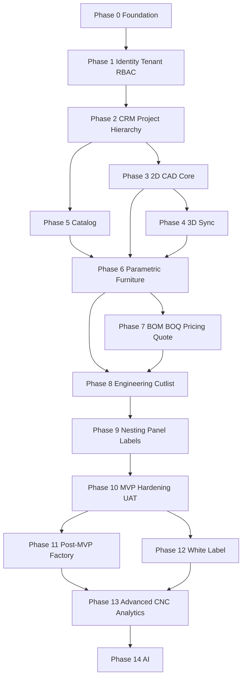

# 24 — Implementation Roadmap (Phase-Wise Plan)

**Product:** FMOS  
**Basis:** DEC-009 Option B (Design-to-Cut MVP) + DEC-001–017  
**Tech stack:** PHP 8.x · MySQL 8.x · Vanilla JS ES6+ · HTML5 · CSS · Three.js · REST `/api/v1`  
**Architecture:** Modular monolith with domain boundaries  
**Date:** 2026-08-10  
**Status:** Planning baseline (HIGH defaults used as *planning assumptions* where owner has not yet confirmed — see §0)

---

## 0. Planning Assumptions (HIGH — pending explicit confirm)

Until overridden, this roadmap assumes:

| ID | Assumption |
| -- | ---------- |
| CONF-PRICE-003 | Default commercial mode = **markup %** |
| CONF-PRICE-004 | Default area UOM = **sq.ft** |
| CONF-SCOPE-004 | CNC machine adapters = **post-MVP** |
| CONF-SCOPE-005 | WL polish/custom domains = **P1**; basic branding fields in foundation |
| CONF-SCOPE-006 | AI = **out of MVP** |
| CONF-SCOPE-007 | MVP UI capped to screens needed by Option B |
| CONF-LIFE-008 | Soft manufacturing release in MVP; hard MES release post-MVP |
| CONF-DATA-003 | Catalog canonical = `catalog_products` |
| CONF-DATA-004 | CAD Y = depth; 3D Y = elevation |
| CONF-DATA-005 | Sequential BOM → BOQ → Pricing |
| CONF-RBAC-005 | Business Owner ≡ `TENANT_OWNER` |
| CONF-TERM-001 | Tenant = SaaS org; Client = CRM end customer |

Reply `ACCEPT ALL HIGH DEFAULTS` to harden these into DEC entries.

---

## 1. North Star & MVP Definition

### North star

```text
ONE PROJECT MODEL → PARAMETRIC TRUTH → DERIVED DESIGN / COMMERCIAL / MANUFACTURING OUTPUTS
```

### MVP success journey (must work end-to-end)

```text
Create Tenant → Org → User/Roles
 → Client → Project → Building/Floor/Room
 → Draw room in 2D → View in 3D
 → Add parametric wardrobe (+ kitchen base/wall/tall/TV as stretch)
 → Configure dimensions & materials
 → Generate BOM → BOQ → Price (waterfall + markup default)
 → Generate quotation (draft→…→approved)
 → Engineering validation → Soft manufacturing release (snapshot)
 → Cutlist → Basic nesting → Panel IDs/labels (print/export)
```

### Explicitly OUT of MVP

- Shop-floor MES execution (scan-to-complete stages)
- QC / packing / dispatch workflows
- CNC machine adapters (Biesse/Homag/KDT)
- Full white-label (custom domains, advanced branding)
- AI copilot / floorplan recognition
- Component Designer (enterprise custom components) — P1
- Native mobile apps
- Accounting/ERP/payroll/HR/inventory ERP

---

## 2. Dependency Graph



---

## 3. Phase Overview

| Phase | Name | Goal | Exit criteria (summary) |
| ----: | ---- | ---- | ----------------------- |
| **0** | Architecture & Foundation | Repo skeleton, conventions, tooling | App boots; migrations run; health check |
| **1** | Identity, Tenant, Org, RBAC | Secure multi-tenant access | Login; tenant isolation tests; 27 roles seeded |
| **2** | CRM & Project Hierarchy | Commercial + spatial containers | Client→Project→Building→Floor→Room CRUD |
| **3** | 2D CAD Core | Authoritative spatial design | Walls/doors/windows; undo; save/load |
| **4** | 3D Sync | Same model in Three.js | 2D change updates 3D; selection sync |
| **5** | Catalog | Boards/laminates/edge/hardware | Publish lifecycle; assign materials |
| **6** | Parametric Furniture | Wardrobe vertical slice | Params→components→2D/3D |
| **7** | Commercial | BOM/BOQ/Pricing/Quote | Deterministic calc; snapshot on approve |
| **8** | Engineering & Cutlist | Soft mfg release | Validation; panels; cutlist; snapshot |
| **9** | Nesting & Panel Labels | Design-to-cut proof | Basic nest; panel IDs; printable labels |
| **10** | MVP Hardening | Production-ready MVP | E2E UAT; security; backups; docs |
| **11** | Factory Light (P1) | MES + QR scan + QC/pack/dispatch | Shop-floor loop works |
| **12** | White Label (P1) | Branding + custom domains | Tenant branded experience |
| **13** | Advanced Mfg (P2) | CNC adapters, advanced nesting, analytics | Machine output + factory KPIs |
| **14** | AI (P3) | Assistive AI behind gateway | Editable AI proposals; no auto-release |

---

## 4. Detailed Phases

### Phase 0 — Architecture & Foundation

**Objective:** Establish implementable modular monolith skeleton without business features.

**Deliverables**
- Directory layout by domain (`Identity`, `Tenant`, `Project`, `Architecture`, `Furniture`, `Catalog`, `Pricing`, `BOM`, `BOQ`, `Manufacturing`, `Documents`, `Audit`)
- PHP bootstrap, router, config via `.env` / `.env.example`
- MySQL migrations framework
- REST response envelope (`success` / `error` codes per SRS)
- Frontend module loader (ES modules), shared CSS, layout shell
- Logging, error handler, request ID
- Storage abstraction interface (local filesystem first)
- CI skeleton (lint + unit test runner)
- ADR stubs: modular monolith, tenant isolation, mm units, no JS framework

**Database**
- Migration tooling only; seed empty schema version table

**APIs**
- `GET /api/v1/health`

**UI**
- Blank authenticated shell placeholder (wired in Phase 1)

**Security**
- Secrets only via env; no credentials in git

**Tests**
- Smoke: health endpoint; migration up/down

**Depends on:** none  
**Decision refs:** DEC-007 (vanilla FE), architecture docs

**Exit criteria**
- [ ] Fresh clone → configure env → migrate → health 200
- [ ] Domain folders exist with README boundaries
- [ ] No business logic in controllers / HTML

---

### Phase 1 — Identity, Tenant, Organization, RBAC

**Objective:** Secure SaaS foundation with real Organization tier.

**Deliverables**
- Auth: register/login/logout, password hash, session/token, password reset (time-limited)
- Entities: `tenants`, `organizations`, `users`, `roles`, `permissions`, `user_roles`, `role_permissions`, `sessions`
- Seed **27 RBAC roles** + permission catalog
- Platform role `PLATFORM_SUPER_ADMIN` + distinct `SUPPORT` (impersonation permission, audited, time-limited)
- Tenant isolation middleware on all tenant-scoped queries
- Org-scoped queries under tenant
- Basic tenant settings (name, currency default INR, measurement prefs, logo fields — basic branding only)
- Audit log foundation (append-oriented)

**Key APIs**
- `/auth/*`, `/tenants`, `/organizations`, `/users`, `/roles`, `/permissions`

**UI screens (MVP)**
- Login, platform admin tenants, tenant admin users/roles, org list

**Security**
- CSRF, parameterized SQL, server-side authorization, session expiry
- MFA deferred optional for platform/tenant admins (P1 hardening)

**Tests**
- Isolation: user cannot read other tenant by ID
- RBAC: denied without permission
- Impersonation: support only with audit

**Decision refs:** DEC-004, DEC-005, DEC-012, DEC-014, DEC-015

**Exit criteria**
- [ ] Cross-tenant access blocked in automated tests
- [ ] Org belongs to tenant; project will require org_id (Phase 2)
- [ ] `manufacturing.release` present in permission seed but unused until Phase 8

---

### Phase 2 — CRM & Project Hierarchy

**Objective:** Commercial entry + spatial containers + dual project status fields.

**Deliverables**
- CRM: leads, clients, contacts, opportunities (convert → project)
- Project with **`status`** + **`workflow_stage`** (DEC-001)
- Building / Floor / Room
- Project members assignment
- Soft delete where historical refs needed
- Revision foundation (`project_revisions` scaffolding)

**Key APIs**
- `/clients`, `/leads`, `/opportunities`, `/projects`, `/buildings`, `/floors`, `/rooms`

**UI**
- Client list/detail, project list/detail, hierarchy navigator

**Business rules**
- Every project has `tenant_id` + `organization_id`
- Client is CRM end customer (not SaaS tenant)

**Tests**
- Opportunity → project conversion
- Status vs workflow_stage independent updates with validation

**Decision refs:** DEC-001, DEC-004, CONF-TERM-001 assumption

**Exit criteria**
- [ ] Full hierarchy create/read/update
- [ ] Concurrent update version field rejects stale writes

---

### Phase 3 — 2D CAD Core

**Objective:** Authoritative plan geometry in mm.

**Deliverables**
- 2D workspace: pan/zoom/select/move/copy/rotate/mirror/delete
- Grid, snap, ortho (MVP subset of SHOULD tools)
- Walls, doors, windows (parametric properties)
- Dimensions, annotations
- Command pattern + undo/redo
- Domain model as source of truth (renderer is view only)
- Coordinate lock: **CAD Y = plan depth** (assumption CONF-DATA-004)

**APIs**
- `/design/objects` CRUD + batch save; project revision bump

**UI**
- 2D designer screen + property panel

**Tests**
- Geometry unit tests (length, openings)
- Undo restores model

**Exit criteria**
- [ ] Save/reload room geometry lossless (within float tolerance)
- [ ] No business data stored only in canvas

---

### Phase 4 — 3D Synchronization

**Objective:** Three.js view of the same domain objects.

**Deliverables**
- 3D scene generation from domain model
- Orbit/pan/zoom, selection highlight sync with 2D
- Materials basic display
- Mapping: CAD Y → 3D Z; **3D Y = elevation**
- Web Worker optional for heavy mesh prep (SHOULD)

**UI**
- Split or tabbed 2D/3D

**Tests**
- Wall resize updates 3D mesh bounds
- Selection ID mapping domain ↔ mesh

**Exit criteria**
- [ ] No manual export/import between 2D and 3D
- [ ] Three.js is never authoritative state

---

### Phase 5 — Materials & Catalog

**Objective:** Tenant catalog for boards, laminates, edge bands, hardware.

**Deliverables**
- `catalog_products` (+ typed extensions: board/laminate/edge/hardware)
- Dual status: publish lifecycle + commercial availability (assumption)
- Designers consume **PUBLISHED** items by default
- CSV import workflow: upload→validate→preview→confirm
- Versioning so historical quotes remain reproducible later

**APIs**
- `/catalog/products`, import endpoints

**UI**
- Catalog list, product form, import wizard

**Exit criteria**
- [ ] Assign material to wall/furniture surface from published catalog
- [ ] Inactive/unpublished not selectable in designer

---

### Phase 6 — Parametric Furniture Engine (Vertical Slice)

**Objective:** Prove architecture with **Wardrobe** first; then kitchen base/wall/tall + TV unit.

**Deliverables**
- Furniture templates + versions
- Parameter validation (min/max/unit)
- Deterministic rule engine (**no arbitrary PHP/JS formula execution**)
- Component generation (sides, top, bottom, shelves, shutters, back, hardware hooks)
- Place furniture in room; edit params; 2D + 3D update
- Stale-flag hooks for downstream artifacts (wired in later phases)
- Template version freeze on instance when published template changes

**APIs**
- `/furniture/templates`, `/furniture/instances`, recalc endpoints

**UI**
- Furniture insert, parameter form, template admin (tenant)

**Tests**
- Golden tests: width change recalculates shelf width
- Invalid dimensions rejected

**Exit criteria**
- [ ] Wardrobe vertical slice acceptance (SRS §126 items 1–7 at minimum)
- [ ] Additional categories plug into same engine without forks

**Stretch within phase:** Kitchen base, wall, tall, TV unit (BRD MVP list)

---

### Phase 7 — BOM, BOQ, Pricing, Quotation

**Objective:** Commercial chain from design with reproducibility.

**Deliverables**
- BOM header + **immutable revisions** (DEC-013)
- BOQ header + revisions; commercial edit where permitted
- Pricing engine:
  - Dual models: raw-material + panel/unit
  - Waterfall: Cost → Markup/Margin → Gross → Discount → Tax → Final (DEC-006)
  - Margin formula DEC-017; default mode **markup** (assumption)
  - Area rates default **sq.ft** (assumption)
- Quotation statuses per SRS + **ACCEPTED** after APPROVED (assumption)
- Approved/accepted quotes snapshot pricing basis (must not change if rates change)
- Explainability breakdown for authorized roles

**APIs**
- `/bom`, `/boq`, `/pricing/*`, `/quotations`

**UI**
- BOM view, BOQ editor, pricing review, quotation PDF/print

**RBAC**
- Estimator prepares; sales/owner approve per matrix; cost visibility restricted

**Tests**
- Determinism: same revisions → same totals
- Historical quote immutable after approve/accept

**Exit criteria**
- [ ] Full commercial path from wardrobe materials to quotation PDF
- [ ] Rate change does not alter approved quotation

---

### Phase 8 — Engineering Validation, Soft Manufacturing Release, Cutlist

**Objective:** Manufacturing-ready engineering without shop-floor MES.

**Deliverables**
- Engineering validation severities INFO/WARNING/ERROR/BLOCKER
- Panel decomposition + edge banding + hardware quantities
- Cutlist generation
- Soft gate: `MANUFACTURING_READY` / release snapshot (DEC soft gate)
- Release permission: **`MANUFACTURING_MANAGER` only** (DEC-014)
- Manufacturing revision snapshot: design, params, materials, BOM, panels, cutlist, rules versions
- Stale dependency marking when design changes after generate
- Post-release design change → new revision required (no silent overwrite)

**APIs**
- `/engineering/validate`, `/manufacturing/generate`, `/manufacturing/release`, `/cutlists`

**UI**
- Validation report, manufacturing workspace, release confirm dialog

**Tests**
- BLOCKER blocks release
- Released snapshot immutable
- Engineer cannot release

**Exit criteria**
- [ ] Released package exportable/viewable
- [ ] Changing wardrobe width marks cutlist stale and blocks silent overwrite

---

### Phase 9 — Basic Nesting & Panel Labels (MVP Capstone)

**Objective:** Complete design-to-cut MVP.

**Deliverables**
- Basic heuristic nesting (sheet sizes, kerf, grain, rotation rules subset)
- Nesting result bound to manufacturing revision
- Utilization / waste metrics
- Panel unique IDs (public identifier)
- Printable QR/barcode **labels** (payload = ID only; details via authenticated lookup later)
- Export nest layout + cutlist CSV
- Panel status enum seeded to **QR-canonical** FSM (RELEASED before NESTED) even if transitions limited in MVP

**APIs**
- `/nesting/jobs`, `/panels`, `/panels/labels`

**UI**
- Nesting preview, label print sheet

**Out of scope here**
- Scan-to-complete shop floor, CNC adapters, remnants inventory ERP

**Exit criteria**
- [ ] MVP journey §1 fully demonstrable
- [ ] Labels print; IDs unique per tenant

---

### Phase 10 — MVP Hardening, UAT & Production Readiness

**Objective:** Make Option B shippable.

**Deliverables**
- E2E UAT script for MVP journey
- Security review pass (tenant isolation, authZ, uploads, XSS/CSRF)
- Backup/restore drill for DB + files
- Performance pass on representative project (async jobs for BOM/nest/PDF)
- Audit coverage for price change, approve, release
- Documentation: `/docs` architecture, API list, operator guide
- Bugfix / polish UI empty/error/loading states
- Feature flags scaffolding (`enable_mes`, `enable_ai_floorplan`, etc. off)

**Exit criteria**
- [ ] UAT signed for MVP journey
- [ ] Restore tested
- [ ] No P0 open defects in MVP path

---

### Phase 11 — Factory Light (Post-MVP / P1)

**Objective:** Shop-floor execution on released snapshots.

**Deliverables**
- Production orders (`PO_*` statuses) vs manufacturing packages (`MFG_*`)
- Work orders (MES-owned execution statuses)
- QR scan endpoints; panel FSM transitions (canonical QR)
- Stages: cutting → edge → drill → route → assembly → QC → pack → dispatch
- QC pass/fail/rework; packing; dispatch records
- Responsive web shop-floor UI (not native app)

**Depends on:** Phase 9–10  
**Decision refs:** DEC-002, DEC-003, LIFE assumptions

---

### Phase 12 — White Label & SaaS Polish (P1)

**Objective:** Branded tenant experience.

**Deliverables**
- Full branding (colors, email/PDF templates, terms)
- Custom domain resolution
- Subscription/plan hooks (as required by WL spec subset)
- Client portal refinements (`CLIENT_ADMIN` / `CLIENT_USER`)

---

### Phase 13 — Advanced Manufacturing (P2)

**Objective:** Machine integration & optimization.

**Deliverables**
- CNC adapter framework + DXF/CSV/generic; then Biesse/Homag/KDT as funded
- Advanced nesting (guillotine/maxrects, remnants)
- Factory dashboards / OEE-style analytics
- Multi-factory configuration

---

### Phase 14 — AI (P3)

**Objective:** Assistive intelligence without owning engineering truth.

**Deliverables**
- Provider-agnostic AI gateway
- Floorplan image → editable proposal (human verify)
- Design assistant suggestions
- **Hard rule:** AI output never auto-releases to manufacturing

---

## 5. Suggested Calendar (indicative)

Sizing assumes a small team (e.g. 2–4 full-stack). Adjust to capacity.

| Phase | Indicative duration | Cumulative |
| ----: | ------------------- | ---------- |
| 0 | 1–2 weeks | 2w |
| 1 | 2–3 weeks | 5w |
| 2 | 2 weeks | 7w |
| 3 | 3–4 weeks | 11w |
| 4 | 2–3 weeks | 14w |
| 5 | 2 weeks | 16w |
| 6 | 4–5 weeks | 21w |
| 7 | 3–4 weeks | 25w |
| 8 | 3 weeks | 28w |
| 9 | 2–3 weeks | 31w |
| 10 | 2–3 weeks | **~8 months MVP** |
| 11–14 | Funded separately | Post-MVP |

---

## 6. Vertical Slice Strategy

Do **not** build all furniture categories before commercial/manufacturing.

```text
Wardrobe only
  → BOM/BOQ/Price/Quote
  → Cutlist/Nest/Labels
  → then add Kitchen/TV templates on same rails
```

---

## 7. What Each Phase Must Always Include

For every phase exit:

1. Migrations  
2. Domain services (not fat controllers)  
3. APIs with RBAC  
4. UI wired to APIs  
5. Unit/integration tests for new rules  
6. Audit events for critical writes  
7. Traceability note: requirements/DEC IDs touched  

---

## 8. Risk Watchlist (by phase)

| Phase | Primary risk | Mitigation |
| ----: | ------------ | ---------- |
| 1 | Tenant leak | Automated isolation suite from day 1 |
| 3–4 | Geometry sync bugs | Single domain model; golden fixtures |
| 6 | Rule engine complexity | Deterministic DSL; no eval; wardrobe first |
| 7 | Money drift | Snapshots + DEC-017 tests |
| 8–9 | Stale manufacturing data | Snapshot + stale flags + release ACL |
| 11 | FSM sprawl | QR-canonical enum only |

---

## 9. Immediate Next Engineering Actions

1. Confirm HIGH defaults (`ACCEPT ALL HIGH DEFAULTS`)  
2. Scaffold Phase 0 repo structure in application code (new workstream)  
3. Author Phase 1 migrations for Tenant/Org/User/RBAC  
4. Maintain living traceability as modules land  

---

## 10. Document Control

| Version | Date | Notes |
| ------- | ---- | ----- |
| 1.0 | 2026-08-10 | Initial roadmap from DEC-009 Option B |

**Related:** `00_EXECUTIVE_SUMMARY.md`, `06_DECISION_REGISTER.md`, `23_DEPENDENCY_ANALYSIS.md`
